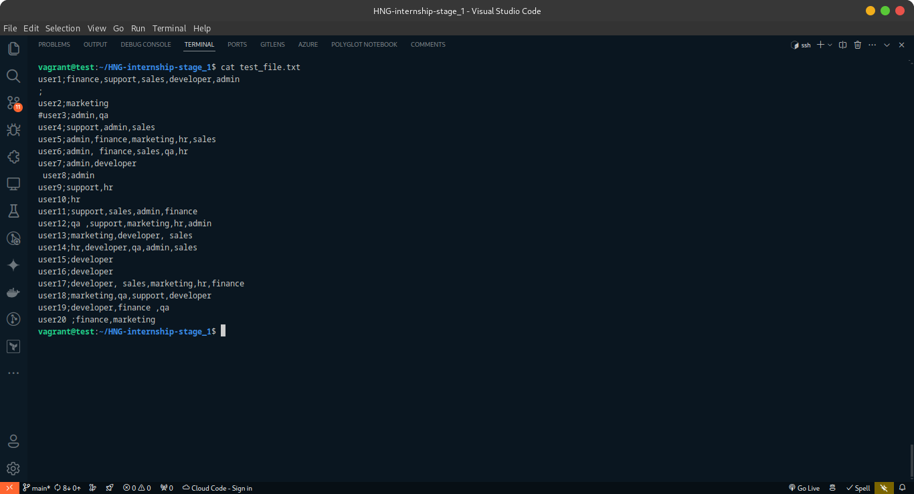
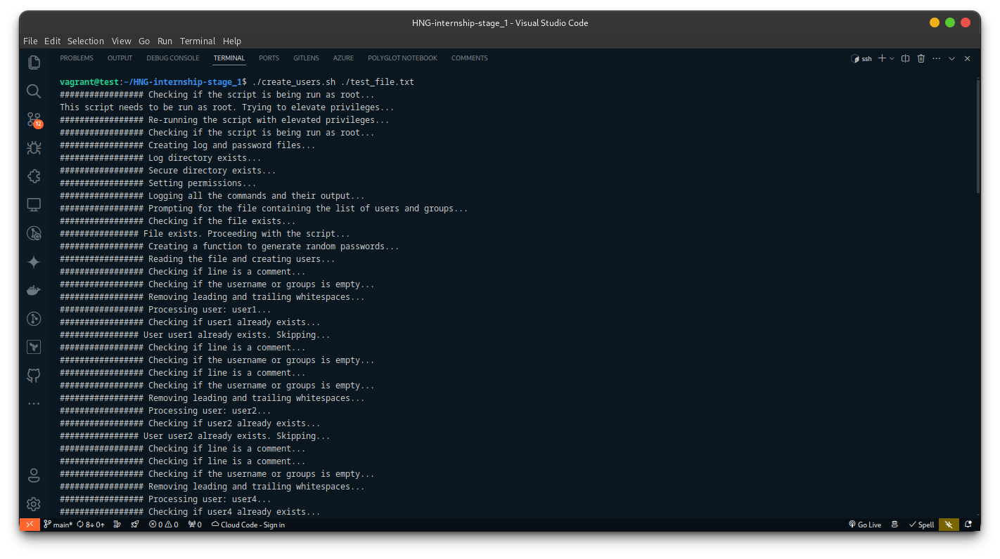
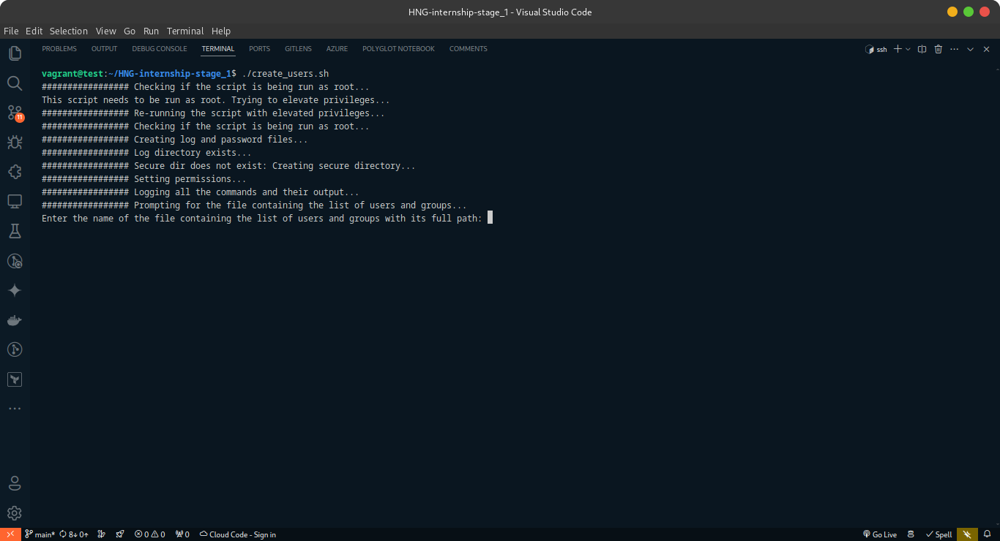
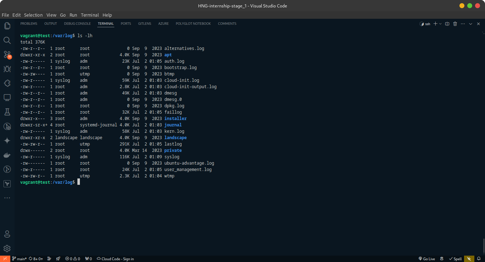
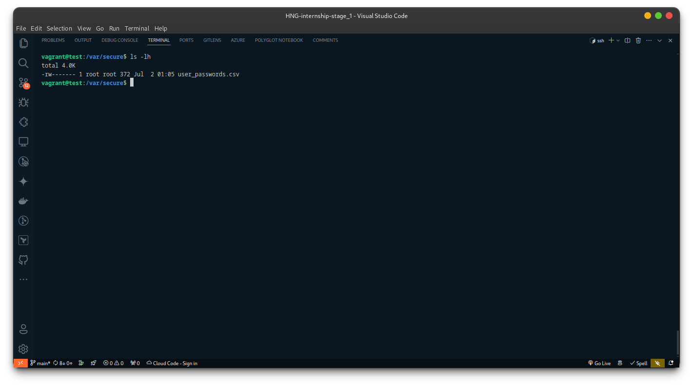
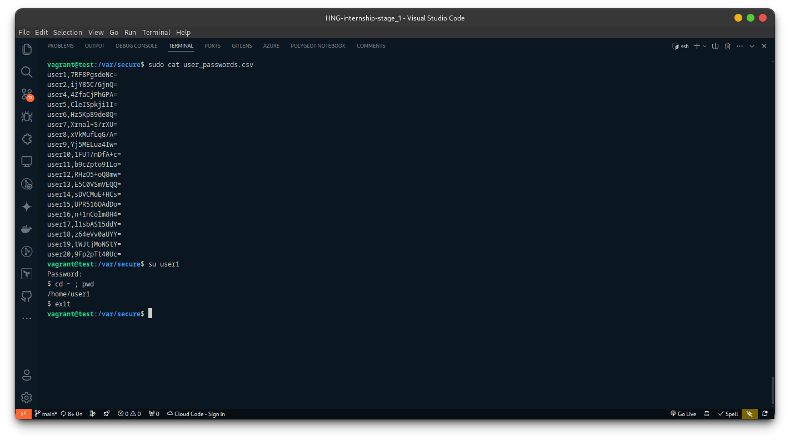
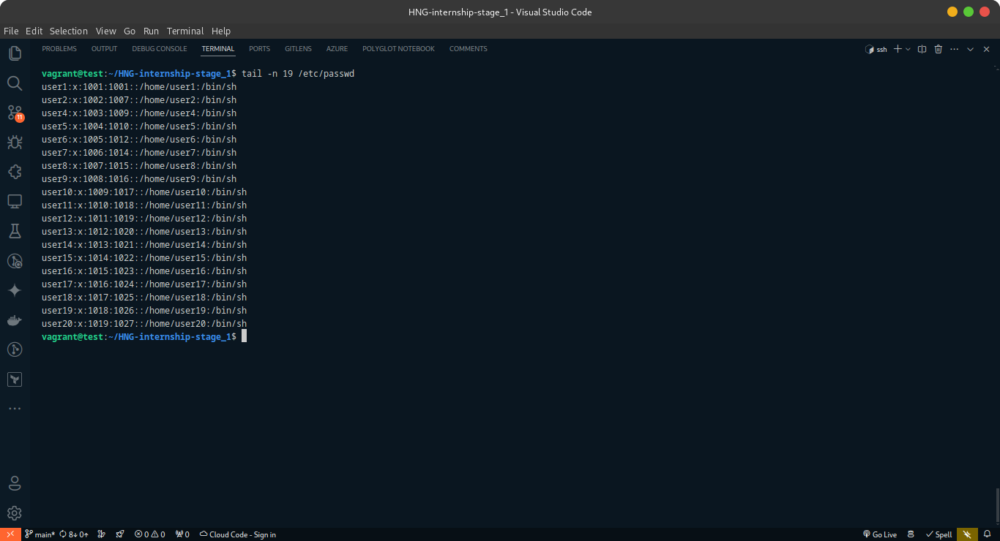
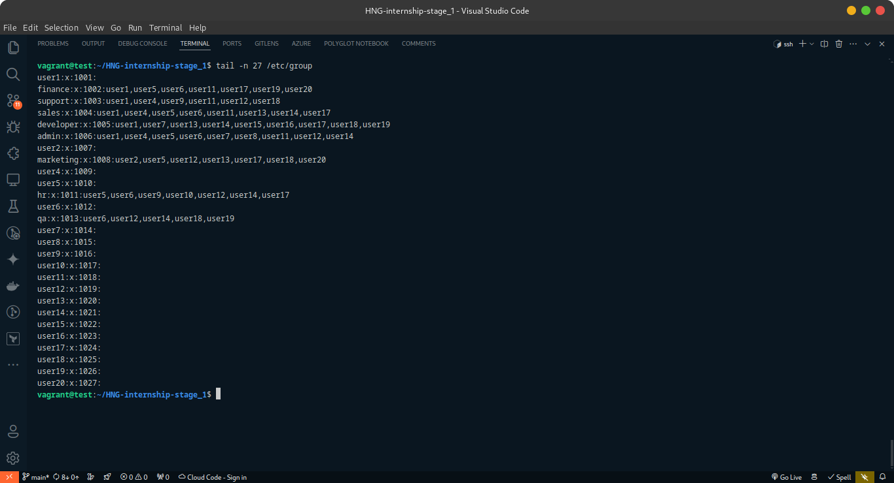

# Automated Linux User Creation

---

## Table of Contents

- [Overview](#overview)
- [Prerequisites](#prerequisites)
- [Input File Format](#input-file-format)
- [Features](#features)
- [Script](#script)
- [Usage](#usage)
- [Testing](#testing)
- [Security Considerations](#security-considerations)
- [Troubleshooting](#troubleshooting)
- [Conclusion](#conclusion)

---

## Overview

The `create_users.sh` script is designed to automate the process of creating user accounts on a Linux system. It reads a specified file containing a list of usernames and their associated groups, generates random passwords for each user, creates the user with the generated password, and assigns the user to the specified groups. Additionally, it handles logging and ensures that the script is run with root privileges.

---

## Prerequisites

- A Linux system with `bash`, `openssl`, `useradd`, `groupadd`, and `usermod` commands available.
- Root access or sudo privileges to create users and groups.
- The input file containing the list of users and groups, formatted as described below.

---

## Input File Format

The script expects an input file where each line represents a user and their associated groups, formatted as follows:

```txt
username;group1,group2,group3
```

- `username` is the name of the user to be created.
- `group1`,`group2`,`group3` are the groups to which the user will be added. Multiple groups are separated by commas.

Lines starting with `#` are considered comments and ignored.
Empty lines are also ignored.
Leading and trailing whitespace is removed from the username and group names.

---

## Features

1. Root Privilege Check: Ensures the script is run with root privileges, attempting to elevate privileges if not.
2. Logging: Logs all operations to `/var/log/user_management.log`.
3. Secure Directory and File Handling: Creates a secure directory (`/var/secure`) and files for logging and storing user passwords with restricted access permissions.
4. User and Group Management:
   - Reads the input file line by line.
   - Skips empty lines and comments.
   - Generates a random password for each user using `openssl`.
   - Encrypts the password using SHA-512 hashing.
   - Creates the user with the encrypted password and a home directory.
   - Creates any specified groups that do not already exist.
   - Adds the user to the specified groups.
5. Error Handling: Provides feedback on the success or failure of user and group creation operations.

---

## Script

   ```bash
   #!/bin/bash

   # Step 1: Check if the script is being run as root, if not, request root access
   echo "################# Checking if the script is being run as root..."
   if [[ "$(id -u)" -ne 0 ]]; then
   echo "This script needs to be run as root. Trying to elevate privileges..."
   echo "################# Re-running the script with elevated privileges..."
   sudo -E "$0" "$@"
   exit
   fi

   # Step 2: Create the log and password files and set appropriate permissions
   echo "################# Creating log and password files..."
   secure_dir="/var/secure"
   log_dir="/var/log"
   log_file="/var/log/user_management.log"
   password_file="/var/secure/user_passwords.csv"

   if [[ ! -d "$log_dir" ]]; then # Check if the log directory exists
   echo "################# Log dir does not exist: Creating log directory..."
   mkdir "$log_dir"
   else
   echo "################# Log directory exists..."
   fi

   if [[ ! -d "$secure_dir" ]]; then # Check if the secure directory exists
   echo "################# Secure dir does not exist: Creating secure directory..."
   mkdir "$secure_dir"
   else
   echo "################# Secure directory exists..."
   fi

   touch "$log_file"
   touch "$password_file"

   echo "################# Setting permissions..."
   chmod 640 "$log_file" # Only root and members of root's group can read and write, others cannot access
   chmod 600 "$password_file" # Only root can read and write

   # Step 3: Log all the commands and their output to the file in /var/log/ called user_management.log
   echo "################# Logging all the commands and their output..."
   exec > >(tee -a "$log_file") 2>&1

   # Step 4: Prompt the user to enter the name of the file containing the list of users and groups if not provided as an argument
   echo "################# Prompting for the file containing the list of users and groups..."
   user_file=$1
   if [[ -z "$user_file" ]]; then
   read -p "Enter the name of the file containing the list of users and groups with its full path: " user_file
   fi

   # Step 5: Check if the file exists, if not exit the script, else proceed
   echo "################# Checking if the file exists..."
   if [[ ! -f "$user_file" ]]; then
   echo "################ Error: The file does not exist. Please provide a valid file name."
   exit 1
   else
   echo "################ File exists. Proceeding with the script..."
   fi

   # Step 6: Create a function to create random passwords for the users
   echo "################# Creating a function to generate random passwords..."
   generate_password() {
   # Generate a random password using openssl
   openssl rand -base64 8
   }

   # Step 7: Read the file line by line and create users with a home directory and random password and add them to the appropriate groups
   echo "################# Reading the file and creating users..."
   while IFS=";" read -r username groups; do
   # Skip the line if it starts with a comment
   echo "################# Checking if line is a comment..."
   [[ "$username" =~ ^#.*$ ]] && continue
   
   # Skip the line if the username or groups is empty
   echo "################# Checking if the username or groups is empty..."
   [[ -z "$username" || -z "$groups" ]] && continue

   # Remove leading and trailing whitespaces
   echo "################# Removing leading and trailing whitespaces..."
   username=$(echo "$username" | xargs)
   groups=$(echo "$groups" | xargs)

   echo "################# Processing user: $username..."

   # Check if the user already exists
   echo "################# Checking if $username already exists..."
   if id "$username" &>/dev/null; then
      echo "################ User $username already exists. Skipping..."
      continue
   fi

   # Generate a random password
   echo "################ Generating a random password for new user..."
   password=$(generate_password)

   # Encrypt the password
   echo "################ Encrypting newly generated password to pass to the user with the -p flag..."
   encrypted_password=$(openssl passwd -6 "$password")

   # Create the user with the encrypted password
   echo "################ Creating $username with the encrypted password..."
   if useradd -m -p "$encrypted_password" "$username"; then
      echo "################ User $username created with password"
   else
      echo "################ Error creating user $username"
      continue
   fi

   # Split groups by comma and iterate over each group
   echo "################ Splitting $groups with ',' into an array of groups..."
   IFS=',' read -ra ADDR <<< "$groups"
   for group in "${ADDR[@]}"; do

   # Remove leading and trailing whitespaces
   echo "################ Removing leading and trailing whitespaces..."
   group=$(echo "$group" | xargs)
   
      # Check if the group exists, if not, create the group
      echo "################ Checking if $group exists..."
      if ! getent group "$group" > /dev/null 2>&1; then
         groupadd "$group"
         echo "Group $group created."
      fi

      # Add the user to the specified group
      echo "Adding $username to $group..."
      if ! usermod -aG "$group" "$username"; then
         echo "################# Error adding $username to $group..."
      else
         echo "################# User $username added to group $group..."
      fi
   done

   # Store the username and encrypted password in the password file
   echo "$username,$password" >> "$password_file"
   done < "$user_file"

   echo "################# User creation process completed successfully."
   ```

---

## Usage

1. Ensure the script has execute permissions:

   ```bash
   chmod +x create_users.sh
   ```

2. Run the script with the input file as an argument:

   ```bash
   ./create_users.sh /path/to/user_file.txt
   ```

   If the input file is not provided as an argument, the script will prompt for it.

---

## Testing

Testing was performed on an Ubuntu 20.04 system with the following input file:



The input file was randomly generated for testing purposes. Some lines have comments, empty lines, and leading/trailing whitespace to test the script's handling of such cases.

The script was executed with the following command:



Here, an argument is provided to the script specifying the input file, like this `./create_users.sh ./test_file.txt`, and the script proceeds to create users and groups as specified in the input file.



If the input file is not provided as an argument, the script will prompt the user to enter the file name.

The script successfully created the users and groups as specified in the input file, handling comments, empty lines, and whitespace appropriately.

The log file `/var/log/user_management.log` contains detailed information about the script execution, including the commands run and their output. You can view the sample log file [here](./.assets/user_management.log).

**Note**: This is just a sample log file. The actual log file can only be accessed by root or members of the root group as seen below:



The passwords for the users are stored in the secure file `/var/secure/user_passwords.csv`, which has restricted access permissions to ensure the security of the passwords.



The password file contains the usernames and their corresponding passwords as can be seen below:



You can see the password was tested on `user1` and it worked successfully, and also the home directory was created for the user.

**Note**: The password file is stored in a secure directory with restricted access permissions to ensure the security of the passwords. The image above is from the test environment, and it has been deleted after the test.

Here are the users and groups created on the system:





The script successfully created the users and groups as specified in the input file, demonstrating its ability to automate user management tasks on a Linux system.

---

## Security Considerations

- The script sets strict permissions on the log and password files to protect sensitive information.
- Passwords are generated using `openssl rand -base64 8` for randomness and security.
- It is recommended to review the generated passwords and change them as necessary.
- All the generated passwords are stored in a secure file with restricted access permissions.

---

## Troubleshooting

- **Script not running**: Ensure you have execute permissions and are running the script with root or sudo privileges.
- **Users not being created**: Check the `/var/log/user_management.log` file for any error messages related to user or group creation.

---

## Conclusion

The `create_users.sh` script simplifies the process of creating users and managing groups on a Linux system, ensuring secure handling of passwords and logging all actions for auditability. It is a valuable tool for system administrators looking to automate user management tasks.

**Note**: This Project is a part of the [HNG Internship](https://hng.tech/internship), and [HNG Premium](https://hng.tech/premium) tasks. Check them out for more information.

---

## Cheers! 🥂

---
